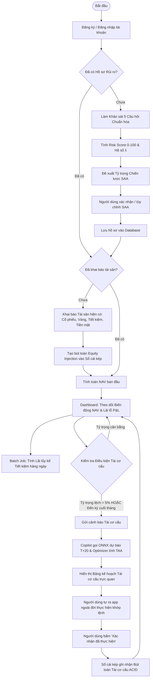

# BẢN ĐẶC TẢ YÊU CẦU PHẦN MỀM VÀ THIẾT KẾ HỆ THỐNG TOÀN DIỆN (MASTER SRS)

## HỆ THỐNG THEO DÕI DANH MỤC VÀ CỐ VẤN TÀI CHÍNH CÁ NHÂN (ROBO-ADVISOR & PORTFOLIO TRACKER)
### TÍCH HỢP SỔ CÁI KÉP, MÔ HÌNH DỰ BÁO HỌC MÁY VÀ TRỢ LÝ AI COPILOT

---

## MỤC LỤC
1. [Thông tin Chung về Đề tài & Mục tiêu Xây dựng](#1-thông-tin-chung-về-đề-tài--mục-tiêu-xây-dựng)
2. [Tác nhân Hệ thống & Ma trận Phân quyền](#2-tác-nhân-hệ-thống--ma-trận-phân-quyền)
3. [Kiến trúc Hệ thống Tổng thể (System Architecture)](#3-kiến-trúc-hệ-thống-tổng-thể-system-architecture)
4. [Đặc tả Toàn trình Luồng Người dùng (End-to-End User Journeys)](#4-đặc-tả-toàn-trình-luồng-người-dùng-end-to-end-user-journeys)
   * 4.1. Sơ đồ Trạng thái Toàn trình (Flowchart)
   * 4.2. Sơ đồ Tuần tự Tương tác (Sequence Diagram)
   * 4.3. Đặc tả 6 Giai đoạn Vận hành Chi tiết
5. [Thiết kế Nghiệp vụ Cốt lõi: Lõi Sổ cái Kép (Core Double-Entry Ledger)](#5-thiết-kế-nghiệp-vụ-cốt-lõi-lõi-sổ-cái-kép-core-double-entry-ledger)
   * 5.1. Bản chất Kế toán: Khai báo Vốn Ban đầu (Equity Injection)
   * 5.2. Các Bút toán Kép Mẫu (Cổ phiếu, Vàng, Tiết kiệm)
   * 5.3. Bất biến Kế toán & Kiểm soát Tranh chấp Đồng thời (Concurrency Control)
   * 5.4. Động cơ Lãi suất kép Tự động (Automated Compound Interest Engine)
6. [Động cơ Tối ưu hóa Danh mục & Khớp lệnh Lô chẵn (Portfolio Optimization)](#6-động-cơ-tối-ưu-hóa-danh-mục--khớp-lệnh-lô-chẵn-portfolio-optimization)
   * 6.1. Mô hình Tối ưu hóa Markowitz MVO Thích ứng Động
   * 6.2. Dịch chuyển Tỷ trọng Chiến thuật (TAA Shift) kết hợp Tín hiệu Học máy
   * 6.3. Thuật toán Quy đổi Tỷ trọng sang Khối lượng Thực tế (Lô 100 HOSE & Chỉ vàng)
7. [Trợ lý Tài chính Thông minh (Financial Copilot - Spring AI)](#7-trợ-lý-tài-chính-thông-minh-financial-copilot---spring-ai)
   * 7.1. Kiến trúc Bảo mật Zero-Trust LLM
   * 7.2. Tra cứu Ngữ cảnh Lai (In-Database Hybrid Search với RRF thuần túy)
   * 7.3. Thiết kế Tool Calling & Nguyên tắc Human-in-the-Loop
8. [Thiết kế Cơ sở Dữ liệu Cốt lõi (Complete Schema DDL - PostgreSQL & pgvector)](#8-thiết-kế-cơ-sở-dữ-liệu-cốt-lõi-complete-schema-ddl---postgresql--pgvector)
9. [Tác vụ Đối soát Sổ cái & Kiểm toán Tự động (Batch Reconciliation & Audit)](#9-tác-vụ-đối-soát-sổ-cái--kiểm-toán-tự-động-batch-reconciliation--audit)
10. [Yêu cầu Phi chức năng & Cam kết Kỹ thuật](#10-yêu-cầu-phi-chức-năng--cam-kết-kỹ-thuật)

---

## 1. Thông tin Chung về Đề tài & Mục tiêu Xây dựng

* **Tên đề tài:** Xây dựng nền tảng Theo dõi Tài sản và Cố vấn Đầu tư Cá nhân, tích hợp Sổ cái kép, Mô hình dự báo Học máy và Trợ lý AI.
* **Mã chuyên ngành:** Kỹ thuật Phần mềm (Software Engineering).
* **Mục tiêu cốt lõi:**
  1. **Quản lý Tài sản Chuẩn xác (ACID Ledger):** Xây dựng công cụ giúp người dùng tự khai báo, quản lý và theo dõi hiệu suất danh mục tài sản thực tế (Cổ phiếu VN30, Vàng miếng SJC/Nhẫn 9999, Tiền gửi tiết kiệm, Tiền mặt). Áp dụng **Sổ cái kép (Double-Entry Bookkeeping)** chuẩn ngân hàng để loại bỏ 100% sai lệch tiền tệ, đảm bảo tính bất biến kế toán.
  2. **Dự báo Chu kỳ Vĩ mô qua Học máy (Embedded ML):** Huấn luyện mô hình phân loại trạng thái thị trường chu kỳ trung hạn ($T+20$ phiên nến ngày), đóng gói theo chuẩn **ONNX** và nhúng trực tiếp vào Spring Boot qua **ONNX Runtime** để thực thi suy luận trong RAM dưới $3\text{ ms}$ mà không cần server Python riêng.
  3. **Tối ưu hóa Danh mục Khoa học (Portfolio Optimizer):** Kết hợp kết quả khảo sát khẩu vị rủi ro cá nhân với dự báo từ mô hình học máy để tự động giải bài toán phân bổ tài sản Markowitz (MVO/TAA), tự động làm tròn khối lượng khớp lệnh theo bước giá thực tế (lô chẵn 100 cổ phiếu sàn HOSE, đơn vị chỉ vàng).
  4. **Trợ lý AI Đàm thoại An toàn (Zero-Trust Financial Copilot):** Tích hợp Spring AI với cơ chế **Zero-Trust Tool Calling** và **In-Database Hybrid Search (RRF thuần túy)** trên PostgreSQL, tuân thủ nghiêm ngặt nguyên tắc **Human-in-the-Loop** (Người dùng toàn quyền quyết định thực hiện ngoài đời thực trước khi ghi nhận sổ cái).

---

## 2. Tác nhân Hệ thống & Ma trận Phân quyền

| Tác nhân (Actor) | Bản chất | Vai trò và Trách nhiệm chính |
| :--- | :--- | :--- |
| **Nhà đầu tư (Investor)** | Người dùng cuối | Thực hiện khảo sát khẩu vị rủi ro, khai báo số vốn và tài sản ban đầu. Tự nhập liệu các giao dịch mua/bán đã thực hiện ở ngoài đời thực. Theo dõi NAV, nhận tư vấn tái cơ cấu từ Copilot và xác nhận cập nhật sổ cái. |
| **Quản trị viên (Admin)** | Người dùng nội bộ | Quản lý danh mục tài sản hợp lệ (`assets`), cập nhật giá thị trường đóng cửa hàng ngày (`market_prices`), giám sát báo cáo đối soát sổ cái định kỳ và mở khóa tài khoản bị nghi ngờ sai lệch. |
| **Financial Copilot** | LLM Agent (Spring AI) | Trợ lý đàm thoại thông minh. Tiếp nhận kết quả tính toán từ thuật toán tối ưu hóa Java, sử dụng Hybrid Search tra cứu cẩm nang tài chính để giải thích kế hoạch tái cơ cấu cho người dùng bằng ngôn ngữ tự nhiên. |
| **ML Inference Engine** | Module tính toán JVM | Thực thi song song 2 mô hình LightGBM ONNX (`stock_regime.onnx` và `gold_trend.onnx`) để xuất ra nhãn xu hướng chu kỳ $T+20$ và xác suất tin cậy $P_{\text{confidence}}$. |
| **Reconciliation Worker** | Batch Job (Spring Batch) | Tự động quét hàng ngày: Tính lãi lũy kế cho sổ tiết kiệm, xử lý tái tục lãi kép khi đáo hạn, và đối soát tính toàn vẹn $\sum \text{Debit} - \sum \text{Credit} = 0$ trên toàn hệ thống. |

---

## 3. Kiến trúc Hệ thống Tổng thể (System Architecture)

Hệ thống được thiết kế theo phong cách **Monolith theo Module (Modular Monolith)** tuân thủ triệt để kiến trúc **Hexagonal (Ports & Adapters)**, tập trung toàn bộ hạ tầng dữ liệu vào **PostgreSQL 16** nhằm tối ưu hóa hiệu năng, giảm thiểu chi phí vận hành (OpEx) và loại bỏ bài toán bất đồng bộ dữ liệu (Dual-Write):

```
[ Web Application / Mobile Client (React / Flutter) ]
                        │
                        ▼ (HTTPS / RESTful API / JWT)
[ API Gateway & Security Layer (Spring Security 6) ]
                        │
    ┌───────────────────┴─────────────────────────────────────────┐
    │                                                             │
    ▼ (ACID Core Ledger)                                          ▼ (Advisory & Optimization)
[ Core Ledger Service ] (Java 21)                     [ Financial Advisory Service ]
 ├── Double-Entry Ingestion Engine                     ├── Spring AI Context Orchestrator
 ├── Invariants & Concurrency Controller               ├── Zero-Trust Tool Calling Layer
 ├── Savings & Compound Interest Engine                └── In-Database Hybrid Search (RRF)
 └── Outbox Event Persistence                                     │
    │                                                             ▼
    │ (Transactional Write)                           [ Portfolio Optimizer ] (Deterministic Math)
    │                                                  ├── Markowitz MVO Quadratic Solver
    ▼                                                  └── Lot-Size Truncation (HOSE 100 / Gold)
┌──────────────────────────────────────────────┐                  ▲
│        HỆ QUẢN TRỊ CSDL POSTGRESQL 16        │                  │ (Feature Ingestion)
├──────────────────────────────────────────────┤                  │
│ • Core Ledger: accounts, entries, txs        │      [ Embedded ONNX Runtime Engine ]
│ • Market Valuation: assets, market_prices    │       ├── stock_regime.onnx (Inference < 1.5ms)
│ • In-Database Vector Store (pgvector + HNSW) │       └── gold_trend.onnx  (Inference < 1.5ms)
│ • Full-Text Search Engine (tsvector + GIN)   │
└──────────────────────────────────────────────┘
                        ▲
                        │ (Daily Cron / Nightly Job)
[ Batch & Audit Engine (Spring Batch) ]
 ├── Daily Savings Accrued Interest Calculator
 ├── Maturity Rollover (Compound Interest Worker)
 └── Full-Ledger Audit & Balance Verifier
```

---

### 3.1. Ngăn xếp Công nghệ Frontend & Ngôn ngữ Thiết kế (Frontend Stack & Design System)

Giao diện Web Client được xây dựng theo kiến trúc **Single Page Application (SPA)** hiện đại, tách biệt hoàn toàn khỏi Backend thông qua giao thức RESTful API / JSON:

* **Core Framework:** **React 18 / 19** kết hợp **TypeScript** và **Vite** (Build tool thế hệ mới với Hot Module Replacement dưới $100\text{ ms}$).
* **Kiểu dữ liệu an toàn (Type-Safety):** Sử dụng TypeScript định nghĩa khớp $100\%$ các DTO từ Backend (`TransactionDTO`, `RebalancePlanDTO`, `AssetHoldingDTO`, `RiskSurveyResponse`).
* **Hệ thống Thiết kế & Bảng Màu (Design System - Clean Light Mode):**
  * Định hướng thẩm mỹ: Phong cách chuẩn Ngân hàng số & Fintech quốc tế (**Stripe, Wise, Robinhood Light Mode**), lấy **Nền trắng tinh khiết (`#FFFFFF`)** kết hợp **Xanh ngọc lục bảo (`#059669`)** làm màu chủ đạo. Loại bỏ hoàn toàn phong cách viễn tưởng (Cyberpunk/Dark Neon) để tạo dựng niềm tin tài chính và tính minh bạch kế toán.
  * **Bộ mã màu quy chuẩn (Design Tokens):**
    * `--bg-app`: `#FFFFFF` (Nền chính) và `--bg-card`: `#F8FAFC` (Nền thẻ phụ Slate 50).
    * `--border-color`: `#E2E8F0` (Đường viền mảnh 1px thanh lịch).
    * `--primary-green`: `#059669` (Màu thương hiệu, đường cong NAV tăng trưởng, nút bấm hành động CTA).
    * `--text-main`: `#0F172A` (Màu chữ đen than Slate 900 sắc nét, độ tương phản cao).
    * `--text-muted`: `#64748B` (Màu nhãn phụ Slate 500).
    * `--color-stock`: `#059669` (Màu Cổ phiếu VN30).
    * `--color-gold`: `#D97706` (Màu Vàng SJC - Hổ phách Amber 600).
    * `--color-savings`: `#0284C7` (Màu Tiết kiệm ngân hàng - Sky Blue 600).
    * `--color-danger`: `#DC2626` (Màu cảnh báo rủi ro / Lệnh bán - Red 600).
* **Bộ Thư viện Chuyên dụng:**
  * **Biểu đồ Tài chính:** **Recharts** – Vẽ đường cong hiệu suất NAV mượt mà có dải màu gradient nhạt, biểu đồ Donut cơ cấu 3 lớp tài sản, và biểu đồ tăng trưởng dòng tiền lãi kép.
  * **Bộ Biểu tượng (Icons):** **Lucide React** – Hệ thống icon tối giản, sắc nét chuẩn giao diện tài chính ngân hàng.
  * **Quản lý Trạng thái & Gọi API:** **Axios** kết hợp **TanStack Query (React Query)** – Tự động cache dữ liệu, tối ưu hóa tái đồng bộ khi phát sinh giao dịch mới, tự động gắn JWT Bearer Token vào Request Header.

---

### 3.2. Quyết định Kỹ thuật: Lựa chọn Vite thay vì Next.js cho Bài toán Này

Trong quá trình thiết kế kiến trúc, nhóm phát triển đã tiến hành phân tích trade-off chuyên sâu giữa **Next.js (SSR)** và **Vite (React SPA)** cho dự án này:

| Tiêu chí So sánh | Vite (React SPA) - **ĐƯỢC CHỌN** | Next.js (SSR / Hybrid) |
| :--- | :--- | :--- |
| **Bản chất Nghiệp vụ** | Dashboard quản lý tài sản cá nhân nằm sau lớp bảo vệ JWT. **Hoàn toàn không cần SEO** vì Google Bot không thể đăng nhập vào xem số dư. | Sinh ra để tối ưu hóa SEO cho web thương mại điện tử, báo chí, blog. Không phát huy tác dụng cho Dashboard nội bộ. |
| **Xử lý Biểu đồ Tài chính** | Chạy $100\%$ mượt mà ở Client, không bao giờ bị lỗi. | Các thư viện chart (Recharts, Chart.js) cần đối tượng `window`. Trên Next.js rất dễ dính lỗi **Hydration Mismatch / `window is not defined`**, ép buộc mọi trang dashboard phải gắn `'use client'`. |
| **Tài nguyên Triển khai** | Build ra thư mục tĩnh thuần túy `dist/`. Chạy container Nginx chỉ ngốn **$\approx 20\text{ MB}$ RAM**. | Bắt buộc phải duy trì một Node.js Server chạy 24/7 để phục vụ SSR, tiêu tốn **$200\text{--}400\text{ MB}$ RAM**. |
| **Độ phức tạp Hệ thống** | Tinh gọn, không lo lỗi CORS/Cookie cross-domain phức tạp. | Dễ phát sinh lỗi cấu hình mạng cross-domain giữa server Next.js và server Spring Boot. |

$\Rightarrow$ **Kết luận Kiến trúc:** Lựa chọn **React + Vite** là giải pháp tối ưu số một về độ ổn định, hiệu năng hiển thị biểu đồ và khả năng mở rộng.

---

### 3.3. Chiến lược Đóng gói & Triển khai Hệ thống (Deployment Strategy)

Hệ thống hỗ trợ **3 kịch bản triển khai linh hoạt**:

1. **Kịch bản 1: Cloud Decoupled (Khuyên dùng cho Môi trường Test & Production):**
   * *Frontend (Vite):* Chạy lệnh `npm run build` xuất ra thư mục tĩnh `dist/`, triển khai tự động lên **Vercel, Netlify hoặc Cloudflare Pages (Miễn phí 100%, có CDN toàn cầu)** thông qua GitHub Actions CI/CD.
   * *Backend (Spring Boot) & Database (PostgreSQL 16):* Đóng gói Docker container triển khai trên Railway, Render, hoặc máy chủ VPS.
2. **Kịch bản 2: Docker Compose Production (Triển khai trên VPS / Server độc lập):**
   * Sử dụng file `docker-compose.yml` điều phối 3 container:
     * `frontend`: Chạy Nginx Alpine phục vụ static files và cấu hình Reverse Proxy `/api` sang Backend.
     * `backend`: Chạy ứng dụng Spring Boot 3 trên nền tảng Java 21 (Eclipse Temurin).
     * `database`: Chạy PostgreSQL 16 tích hợp sẵn extension `pgvector`.
3. **Kịch bản 3: All-in-One Embedded JAR (Tùy chọn Hoàn hảo khi Báo cáo / Bảo vệ Đồ án):**
   * Sao chép toàn bộ thư mục build `dist/*` của Vite vào thư mục `src/main/resources/static/` của dự án Spring Boot.
   * Maven/Gradle đóng gói toàn bộ Frontend và Backend thành **1 file `.jar` duy nhất**.
   * Khi chấm đồ án, chỉ cần chạy đúng 1 câu lệnh duy nhất:
     ```bash
     java -jar portfolio-tracker-all-in-one.jar
     ```
     Hệ thống tự động phục vụ cả giao diện người dùng và toàn bộ RESTful API trên cùng cổng `8080`, loại bỏ $100\%$ rủi ro về cài đặt môi trường Node.js hay xung đột port trên máy chấm thi của Hội đồng.

---

## 4. Đặc tả Toàn trình Luồng Người dùng (End-to-End User Journeys)

### 4.1. Sơ đồ Trạng thái Toàn trình (Flowchart)



---

### 4.2. Sơ đồ Tuần tự Tương tác (Sequence Diagram)

```mermaid
sequenceDiagram
    autonumber
    actor User as Nhà đầu tư
    participant Web as Giao diện Web/App
    participant Copilot as Financial Copilot (Spring AI)
    participant Opt as Portfolio Optimizer (Java)
    participant ML as ONNX Runtime (JVM)
    participant Ledger as Core Ledger (Java 21)
    participant DB as PostgreSQL 16
    actor Market as Thị trường Thực tế (Sàn/Tiệm vàng)

    %% Khảo sát rủi ro
    User->>Web: Hoàn thành 5 câu hỏi khảo sát rủi ro
    Web->>Ledger: POST /api/v1/profile/risk-survey
    Ledger->>DB: Lưu Risk Score, λ và SAA Target Weights
    DB-->>Ledger: OK
    Ledger-->>Web: Trả về tỷ trọng SAA khuyến nghị

    %% Kích hoạt tái cơ cấu
    Note over Web,Ledger: Phát hiện lệch tỷ trọng thực tế > 5% (Drift Detection)
    User->>Web: Yêu cầu tư vấn tái cơ cấu danh mục
    Web->>Copilot: Hỏi: "Tôi nên tái cơ cấu danh mục thế nào?"
    Copilot->>Opt: Gọi nội bộ generateRebalancePlan()
    Opt->>Ledger: Lấy số dư thực tế từ các tài khoản (Holdings)
    Opt->>ML: Dự báo nhãn xu hướng T+20 cho Cổ phiếu & Vàng
    ML-->>Opt: Trả về Signal (+1, 0, -1) & P_confidence
    Opt->>Opt: Giải bài toán Markowitz MVO & Làm tròn lô 100 cp / Chỉ vàng
    Opt-->>Copilot: Trả về JSON Kế hoạch Tái cơ cấu chi tiết
    Copilot->>DB: Hybrid Search (RRF) cẩm nang tài chính để lấy dẫn chứng
    Copilot-->>Web: Hiển thị Bảng kế hoạch hành động & Lời giải thích tự nhiên

    %% Thực thi Human-in-the-Loop
    User->>Market: Tự thao tác đặt lệnh bán/mua ngoài đời thực
    Market-->>User: Khớp lệnh thực tế hoàn tất
    User->>Web: Nhấp "Xác nhận đã thực hiện theo kế hoạch"
    Web->>Ledger: POST /api/v1/ledger/rebalance/confirm
    Note over Ledger: Mở Transaction ACID: Kiểm tra Σ Debit = Σ Credit
    Ledger->>DB: Ghi Transaction, Entries, cập nhật Accounts & Holdings
    DB-->>Ledger: Commit thành công
    Ledger-->>Web: Phản hồi 200 OK
    Web-->>User: Dashboard cập nhật trạng thái cân bằng mới
```

---

### 4.3. Đặc tả 6 Giai đoạn Vận hành Chi tiết

#### Giai đoạn 1: Onboarding & Khảo sát Khẩu vị Rủi ro (FR-1)
* Người dùng thực hiện bộ 5 câu hỏi chuẩn hóa (Kỳ hạn, Dòng tiền, Mục tiêu, Phản ứng sụt giảm, Kinh nghiệm).
* Hệ thống tính toán $\text{Risk Score} \in [0, 100]$ và ánh xạ sang Hệ số ngại rủi ro $\lambda = 10.0 - 0.09 \times \text{Risk Score}$.
* Khởi tạo tỷ trọng chiến lược ban đầu (Strategic Asset Allocation - SAA Baseline).

#### Giai đoạn 2: Khai báo Danh mục Khởi tạo & Sổ cái Kép (FR-2)
* Người dùng khai báo các tài sản thực tế đang sở hữu ngoài đời: Cổ phiếu VN30 (mã, số lượng, giá vốn), Vàng (loại, chỉ/lượng, giá mua), Sổ tiết kiệm (ngân hàng, tiền gốc, lãi suất, kỳ hạn, ngày gửi, tùy chọn `auto_rollover`), Tiền mặt tự do.
* Hệ thống tự động kích hoạt bút toán **Khai báo Vốn chủ sở hữu (`CAPITAL_INJECTION`)**: Ghi Nợ (Debit) tài sản tương ứng và Ghi Có (Credit) tài khoản đối ứng nguồn vốn `EQUITY_CAPITAL`.

#### Giai đoạn 3: Theo dõi Thường nhật, Định giá NAV & Mô phỏng Lãi kép
* Cập nhật giá thị trường cuối ngày để tính Tổng tài sản ròng ($\text{NAV} = \sum \text{Khối lượng}_i \times \text{Giá thị trường}_i$).
* Tính toán tỷ suất Lãi/Lỗ chưa thực hiện (Unrealized P&L).
* Công cụ mô phỏng tích sản lãi kép dòng tiền đều (Future Value of Annuity) hỗ trợ lập kế hoạch mục tiêu tài chính tương lai.

#### Giai đoạn 4: Cảnh báo Tái cơ cấu (Rebalance Triggers)
Hệ thống giám sát và tự động kích hoạt đề xuất tái cơ cấu khi thỏa mãn 1 trong 3 điều kiện:
1. **Ngưỡng lệch tỷ trọng (Drift Detection):** Tỷ trọng thực tế của bất kỳ lớp tài sản nào lệch quá $\pm 5\%$ so với mục tiêu.
2. **Cảnh báo đổi pha thị trường (Regime Shift):** Mô hình ML phát hiện thị trường chuyển đột ngột từ *Risk-On* sang *Risk-Off*.
3. **Định kỳ cuối tháng (Monthly Rebalance):** Đánh giá lại danh mục vào ngày làm việc cuối cùng của tháng.

#### Giai đoạn 5: Thực thi Ngoài đời & Xác nhận Sổ cái (Human-in-the-Loop)
* Financial Copilot hiển thị bảng kế hoạch hành động chi tiết (Bán bao nhiêu cổ phiếu mã nào, mua mấy chỉ vàng, mở sổ tiết kiệm bao nhiêu tiền).
* Người dùng tự thao tác giao dịch trên ứng dụng chứng khoán hoặc tiệm vàng thực tế.
* Người dùng quay lại ứng dụng nhấp **"Xác nhận đã thực hiện"** $\rightarrow$ Hệ thống sinh bút toán kép ghi nhận thay đổi số dư.

#### Giai đoạn 6: Quản lý Đáo hạn Tiết kiệm & Tự động Hóa Lãi kép
* Batch Job chạy cuối ngày tự tính lãi lũy kế (Daily Accrued Interest) để phản ánh NAV chuẩn xác.
* Đến ngày đáo hạn:
  * Nếu `auto_rollover = true`: Tự động nhập lãi vào gốc ($P_{\text{new}} = P + \text{Lãi}$), mở kỳ hạn mới (Hiện thực hóa Lãi kép).
  * Nếu `auto_rollover = false`: Tự động kết chuyển cả gốc và lãi về ví tiền mặt `VND_WALLET`.

---

## 5. Thiết kế Nghiệp vụ Cốt lõi: Lõi Sổ cái Kép (Core Double-Entry Ledger)

### 5.1. Bản chất Kế toán: Khai báo Vốn Ban đầu (Equity Injection)
Trong kế toán kép, tiền và tài sản không tự sinh ra từ hư vô. Mọi tài sản người dùng khai báo đều đối ứng với nguồn vốn ban đầu:
* Tài khoản tài sản: `VND_WALLET`, `STOCK_{TICKER}`, `GOLD_{TYPE}`, `SAVINGS_DEPOSIT`.
* Tài khoản nguồn vốn đối ứng: `EQUITY_CAPITAL`.
* Bất biến kế toán tuyệt đối:
$$\sum_{j \in \text{Entries}_k} \text{Debit}_j - \sum_{j \in \text{Entries}_k} \text{Credit}_j = 0$$

---

### 5.2. Các Bút toán Kép Mẫu

#### A. Khai báo vốn ban đầu (Ví dụ: Có sẵn 50 triệu tiền mặt và 1.000 cổ phiếu HPG giá vốn 25.000đ):
* Entry 1: Ghi Nợ `VND_WALLET`: $+50,000,000\text{ VND}$
* Entry 2: Ghi Nợ `STOCK_HPG`: $+25,000,000\text{ VND}$ (1.000 cp $\times$ 25.000đ)
* Entry 3: Ghi Có `EQUITY_CAPITAL`: $-75,000,000\text{ VND}$
* Tổng: $\sum \text{Debit} - \sum \text{Credit} = 75,000,000 - 75,000,000 = 0$.

#### B. Mua tài sản từ tiền mặt khả dụng (Ví dụ: Chi 40 triệu mua 5 chỉ vàng SJC):
* Entry 1: Ghi Nợ `GOLD_SJC`: $+40,000,000\text{ VND}$ (Ghi tăng tài sản vàng)
* Entry 2: Ghi Có `VND_WALLET`: $-40,000,000\text{ VND}$ (Ghi giảm tiền mặt khả dụng)
* Tổng: $+40,000,000 - 40,000,000 = 0$.

#### C. Bút toán Lãi kép khi Đáo hạn Tiết kiệm (`auto_rollover = true`):
* Số tiền gửi ban đầu: $100,000,000\text{ VND}$, tiền lãi kỳ hạn 6 tháng: $3,000,000\text{ VND}$.
* Entry 1: Ghi Nợ `SAVINGS_DEPOSIT`: $+3,000,000\text{ VND}$ (Nhập lãi vào gốc tiền gửi)
* Entry 2: Ghi Có `INTEREST_INCOME`: $-3,000,000\text{ VND}$ (Ghi nhận doanh thu tài chính)
* Số tiền gốc mới của kỳ hạn tiếp theo: $103,000,000\text{ VND}$.

---

### 5.3. Bất biến Kế toán & Kiểm soát Tranh chấp Đồng thời (Concurrency Control)
1. **Chống chi tiêu âm / Double-spending:** Mọi thao tác rút vốn hoặc mua tài sản đều kiểm tra ràng buộc số dư: $\text{Balance}_{\text{khả dụng}} \ge \text{Amount}_{\text{giao dịch}}$.
2. **Optimistic Locking:** Bảng `accounts` sử dụng trường `version BIGINT DEFAULT 0` kết hợp `@Version` của JPA. Khi có 2 request giao dịch song song tranh chấp cùng một tài khoản, request đến sau sẽ kích hoạt `OptimisticLockException` và được thử lại tự động (Retry with Exponential Backoff).
3. **Độ chính xác số học:** Sử dụng kiểu dữ liệu `BigDecimal` trong Java (chế độ làm tròn `RoundingMode.HALF_EVEN`) và kiểu `NUMERIC(19, 4)` trong PostgreSQL, triệt tiêu $100\%$ sai số làm tròn số thập phân.

---

## 6. Động cơ Tối ưu hóa Danh mục & Khớp lệnh Lô chẵn (Portfolio Optimization)

### 6.1. Mô hình Tối ưu hóa Markowitz MVO Thích ứng Động
Bài toán tối ưu hóa tìm vector tỷ trọng $w = [w_{\text{Cổ phiếu}}, w_{\text{Vàng}}, w_{\text{Tiết kiệm}}]^T$:

$$\max_{w} U(w) = w^T \mu(t) - \frac{1}{2} \lambda (w^T \Sigma(t) w)$$

* **Hệ ràng buộc:** $\sum_{i=1}^{n} w_i = 1$ và $w_i \ge 0$ (Không bán khống - Long-only).
* **$\lambda$ (Hệ số ngại rủi ro):** Trích xuất từ hồ sơ khảo sát rủi ro của người dùng.
* **$\mu(t)$ (Lợi nhuận kỳ vọng) & $\Sigma(t)$ (Ma trận hiệp phương sai):** Được cập nhật liên tục từ kết quả suy luận của mô hình học máy.

---

### 6.2. Dịch chuyển Tỷ trọng Chiến thuật (TAA Shift) kết hợp Tín hiệu Học máy
Tỷ trọng đề xuất chiến thuật $w_i^{\text{TAA}}$ dịch chuyển quanh mốc neo chiến lược $w_i^{\text{SAA}}$:

$$\Delta w_i = \text{Signal}_i \times P_{\text{confidence}} \times \Delta w_{\max}$$

* $\text{Signal}_i \in \{+1 \text{ (Tăng)}, 0 \text{ (Ngang)}, -1 \text{ (Giảm)}\}$.
* $\Delta w_{\max} = 15\%$: Biên độ dịch chuyển tối đa cho phép trong 1 chu kỳ.
* **Cơ chế Biên An toàn (Safety Bounds):**
  $$w_i^{\text{SAA}} - 15\% \le w_i^{\text{TAA}} \le w_i^{\text{SAA}} + 15\%$$
  Dù mô hình ML có bi quan hay lạc quan đến đâu, danh mục luôn bị chặn trần/chặn sàn quanh tỷ trọng mỏ neo SAA, không bao giờ rơi vào trạng thái "tất tay" (all-in).

---

### 6.3. Thuật toán Quy đổi Tỷ trọng sang Khối lượng Thực tế (Lô 100 HOSE & Chỉ vàng)
Mô hình toán học xuất ra số tiền cần điều chỉnh $\Delta V_i$. Thuật toán Java quy đổi số tiền thành khối lượng giao dịch thực tế tuân thủ quy định thị trường Việt Nam:

1. **Khớp lệnh Cổ phiếu (Sàn HOSE - Lô chẵn 100 cổ phiếu):**
   $$\Delta Q_{\text{stock}} = \left\lfloor \frac{\Delta V_{\text{stock}}}{P_{\text{stock}} \times 100} \right\rfloor \times 100$$
2. **Khớp lệnh Vàng (Đơn vị tính: Chỉ vàng, $1 \text{ Lượng} = 10 \text{ Chỉ}$):**
   $$\Delta Q_{\text{gold}} = \left\lfloor \frac{\Delta V_{\text{gold}}}{P_{\text{gold/chỉ}}} \right\rfloor$$
3. **Phần tiền lẻ phát sinh do làm tròn lô:** Tự động điều chuyển về tài khoản tiền mặt khả dụng `VND_WALLET` hoặc dồn vào Sổ tiết kiệm ngân hàng.

---

## 7. Trợ lý Tài chính Thông minh (Financial Copilot - Spring AI)

### 7.1. Kiến trúc Bảo mật Zero-Trust LLM
* **Không truyền định danh người dùng vào Prompt:** Tuyệt đối không truyền `userId` hay `accountId` vào câu lệnh prompt của mô hình ngôn ngữ lớn để chặn đứng $100\%$ nguy cơ tấn công **IDOR (Insecure Direct Object Reference)** và **Prompt Injection**.
* Danh tính và quyền hạn người dùng được trích xuất ngầm từ `SecurityContextHolder` trong phiên đăng nhập JWT.

---

### 7.2. Tra cứu Ngữ cảnh Lai (In-Database Hybrid Search với RRF thuần túy)
Thay vì sử dụng các mô hình Neural Cross-Encoder Reranker cồng kềnh gây chậm trễ thêm $50\text{--}200\text{ ms}$, hệ thống triển khai **Tìm kiếm lai kết hợp RRF ngay trong PostgreSQL** với thời gian truy vấn $< 5\text{ ms}$:

```sql
WITH 
vector_candidates AS (
    SELECT id, ROW_NUMBER() OVER (ORDER BY embedding <=> :query_embedding) AS rank_vec
    FROM vector_store
    ORDER BY embedding <=> :query_embedding
    LIMIT 20
),
keyword_candidates AS (
    SELECT id, ROW_NUMBER() OVER (ORDER BY ts_rank(tsv, plainto_tsquery('simple', :query_text)) DESC) AS rank_kw
    FROM vector_store
    WHERE tsv @@ plainto_tsquery('simple', :query_text)
    LIMIT 20
)
SELECT 
    v.id, v.content, v.metadata,
    COALESCE(1.0 / (60 + vc.rank_vec), 0.0) + 
    COALESCE(1.0 / (60 + kc.rank_kw), 0.0) AS rrf_score
FROM vector_store v
LEFT JOIN vector_candidates vc ON v.id = vc.id
LEFT JOIN keyword_candidates kc ON v.id = kc.id
WHERE vc.id IS NOT NULL OR kc.id IS NOT NULL
ORDER BY rrf_score DESC
LIMIT 5;
```

---

### 7.3. Thiết kế Tool Calling & Nguyên tắc Human-in-the-Loop
* **Tool Calling nội bộ:** Copilot được trang bị 2 tool chính:
  1. `generateRebalancePlan()`: Gọi bộ giải toán Java Optimizer để lấy kế hoạch mua/bán chính xác dưới dạng JSON.
  2. `simulateCompoundGrowth(principal, monthlyContribution, rate, years)`: Mô phỏng lãi kép dòng tiền đều.
* **Nguyên tắc Anti-Hallucination:** LLM **không bao giờ được phép tự tính toán số tiền**. LLM chỉ nhận cấu trúc JSON xác định từ Java và chuyển ngữ thành lời văn giải thích dễ hiểu.
* **Human-in-the-Loop:** Copilot không có quyền tự ý ghi đè cơ sở dữ liệu sổ cái. Người dùng phải bấm nút xác nhận thì bút toán mới được tạo.

---

## 8. Thiết kế Cơ sở Dữ liệu Cốt lõi (Complete Schema DDL - PostgreSQL & pgvector)

```sql
-- Kích hoạt extension pgvector
CREATE EXTENSION IF NOT EXISTS vector;

-- ============================================================================
-- PHÂN HỆ 1: QUẢN LÝ NGƯỜI DÙNG & HỒ SƠ RỦI RO
-- ============================================================================

-- 1. Bảng Người dùng hệ thống
CREATE TABLE users (
    id BIGSERIAL PRIMARY KEY,
    username VARCHAR(50) NOT NULL UNIQUE,
    email VARCHAR(100) NOT NULL UNIQUE,
    password_hash VARCHAR(255) NOT NULL,
    risk_score INT DEFAULT 50,                         -- Khảo sát rủi ro (0 - 100)
    risk_aversion_lambda NUMERIC(5, 2) DEFAULT 5.00,    -- Hệ số ngại rủi ro λ (1.0 đến 10.0)
    risk_profile VARCHAR(32) DEFAULT 'BALANCED',       -- 'CONSERVATIVE', 'BALANCED', 'GROWTH'
    created_at TIMESTAMP WITH TIME ZONE DEFAULT CURRENT_TIMESTAMP
);

-- 2. Bảng Tỷ trọng Mục tiêu (Dùng cho SAA/TAA & Phát hiện lệch Drift Detection)
CREATE TABLE portfolio_targets (
    id BIGSERIAL PRIMARY KEY,
    user_id BIGINT NOT NULL REFERENCES users(id) ON DELETE CASCADE,
    asset_class VARCHAR(32) NOT NULL,                  -- 'STOCK', 'GOLD', 'CASH_SAVINGS'
    target_weight NUMERIC(5, 4) NOT NULL,              -- Tỷ trọng mục tiêu, ví dụ: 0.4000 (40%)
    updated_at TIMESTAMP WITH TIME ZONE DEFAULT CURRENT_TIMESTAMP,
    CONSTRAINT uk_user_target_class UNIQUE (user_id, asset_class)
);

-- ============================================================================
-- PHÂN HỆ 2: DANH MỤC TÀI SẢN & GIÁ THỊ TRƯỜNG (MARKET VALUATION)
-- ============================================================================

-- 3. Bảng Danh mục Tài sản hợp lệ
CREATE TABLE assets (
    ticker VARCHAR(32) PRIMARY KEY,                    -- 'VND', 'HPG', 'VCB', 'GOLD_SJC', v.v.
    name VARCHAR(100) NOT NULL,
    asset_class VARCHAR(32) NOT NULL                   -- 'CASH', 'STOCK', 'GOLD', 'SAVINGS'
);

-- 4. Bảng Lịch sử Giá thị trường & Định giá NAV hàng ngày
CREATE TABLE market_prices (
    id BIGSERIAL PRIMARY KEY,
    ticker VARCHAR(32) NOT NULL REFERENCES assets(ticker),
    price NUMERIC(19, 4) NOT NULL,                     -- Giá khớp đóng cửa gần nhất
    trade_date DATE NOT NULL,
    updated_at TIMESTAMP WITH TIME ZONE DEFAULT CURRENT_TIMESTAMP,
    CONSTRAINT uk_ticker_date UNIQUE (ticker, trade_date)
);
CREATE INDEX idx_market_prices_ticker_date ON market_prices(ticker, trade_date DESC);

-- ============================================================================
-- PHÂN HỆ 3: LÕI SỔ CÁI KÉP (CORE DOUBLE-ENTRY LEDGER - ACID ENGINE)
-- ============================================================================

-- 5. Bảng Tài khoản con (Sub-accounts trong Sổ cái)
CREATE TABLE accounts (
    id BIGSERIAL PRIMARY KEY,
    user_id BIGINT NOT NULL REFERENCES users(id) ON DELETE CASCADE,
    account_code VARCHAR(64) NOT NULL,                 -- 'VND_WALLET', 'EQUITY_CAPITAL', 'STOCK_HPG', 'GOLD_SJC'
    asset_type VARCHAR(32) NOT NULL REFERENCES assets(ticker),
    balance NUMERIC(19, 4) NOT NULL DEFAULT 0.0000,
    version BIGINT NOT NULL DEFAULT 0,                 -- Optimistic Locking (@Version)
    created_at TIMESTAMP WITH TIME ZONE DEFAULT CURRENT_TIMESTAMP,
    CONSTRAINT uk_user_account UNIQUE (user_id, account_code)
);

-- 6. Bảng Giao dịch tài chính tổng quát
CREATE TABLE transactions (
    id BIGSERIAL PRIMARY KEY,
    transaction_code VARCHAR(64) NOT NULL UNIQUE,
    user_id BIGINT NOT NULL REFERENCES users(id) ON DELETE CASCADE,
    type VARCHAR(32) NOT NULL,                         -- 'CAPITAL_INJECTION', 'BUY', 'SELL', 'REBALANCE'
    status VARCHAR(32) NOT NULL,                       -- 'PENDING', 'POSTED', 'FAILED'
    description TEXT,
    created_at TIMESTAMP WITH TIME ZONE DEFAULT CURRENT_TIMESTAMP
);

-- 7. Bảng các dòng Bút toán Kép (Entries)
CREATE TABLE entries (
    id BIGSERIAL PRIMARY KEY,
    transaction_id BIGINT NOT NULL REFERENCES transactions(id) ON DELETE CASCADE,
    account_id BIGINT NOT NULL REFERENCES accounts(id),
    amount NUMERIC(19, 4) NOT NULL,                    -- Dương: Nợ (Debit), Âm: Có (Credit)
    created_at TIMESTAMP WITH TIME ZONE DEFAULT CURRENT_TIMESTAMP
);
CREATE INDEX idx_entries_account_id ON entries(account_id);
CREATE INDEX idx_entries_tx_id ON entries(transaction_id);

-- ============================================================================
-- PHÂN HỆ 4: QUẢN LÝ TIỀN GỬI TIẾT KIỆM & LÃI KÉP (SAVINGS & COMPOUND INTEREST)
-- ============================================================================

-- 8. Bảng Sổ tiền gửi tiết kiệm
CREATE TABLE savings_deposits (
    id BIGSERIAL PRIMARY KEY,
    user_id BIGINT NOT NULL REFERENCES users(id) ON DELETE CASCADE,
    account_id BIGINT NOT NULL REFERENCES accounts(id),
    bank_name VARCHAR(64) NOT NULL,
    principal_amount NUMERIC(19, 4) NOT NULL,          -- Số tiền gốc gửi ban đầu
    interest_rate NUMERIC(5, 2) NOT NULL,              -- Lãi suất %/năm (Ví dụ: 6.00)
    term_months INT NOT NULL,                          -- Kỳ hạn gửi (1, 3, 6, 12 tháng)
    start_date DATE NOT NULL,
    maturity_date DATE NOT NULL,                       -- Ngày đáo hạn
    auto_rollover BOOLEAN NOT NULL DEFAULT TRUE,       -- TRUE: Tự động nhập lãi vào gốc (Lãi kép)
    accrued_interest NUMERIC(19, 4) NOT NULL DEFAULT 0.0000, -- Lãi lũy kế tạm tính hàng ngày
    status VARCHAR(32) NOT NULL DEFAULT 'ACTIVE',      -- 'ACTIVE', 'SETTLED', 'CLOSED'
    created_at TIMESTAMP WITH TIME ZONE DEFAULT CURRENT_TIMESTAMP
);
CREATE INDEX idx_savings_user_maturity ON savings_deposits(user_id, maturity_date, status);

-- ============================================================================
-- PHÂN HỆ 5: TRANSACTIONAL OUTBOX
-- ============================================================================

-- 9. Bảng Transactional Outbox
CREATE TABLE outbox_events (
    id UUID PRIMARY KEY,
    aggregate_type VARCHAR(64) NOT NULL,
    aggregate_id VARCHAR(64) NOT NULL,
    event_type VARCHAR(64) NOT NULL,
    payload JSONB NOT NULL,
    status VARCHAR(32) NOT NULL DEFAULT 'PENDING',      -- 'PENDING', 'SENT'
    created_at TIMESTAMP WITH TIME ZONE DEFAULT CURRENT_TIMESTAMP
);
CREATE INDEX idx_outbox_status_created ON outbox_events(status, created_at);

-- ============================================================================
-- PHÂN HỆ 6: HYBRID SEARCH KNOWLEDGE BASE (PGVECTOR + FULL-TEXT SEARCH)
-- ============================================================================

-- 10. Bảng Vector Store nâng cấp cho Hybrid Search
CREATE TABLE vector_store (
    id UUID PRIMARY KEY DEFAULT gen_random_uuid(),
    content TEXT NOT NULL,                             -- Trích đoạn cẩm nang tri thức tài chính
    metadata JSONB,                                    -- Metadata lọc nghiệp vụ: {"topic": "GOLD"}
    embedding VECTOR(1536),                            -- Không gian nhúng vector (OpenAI 1536 chiều)
    tsv TSVECTOR GENERATED ALWAYS AS (to_tsvector('simple', content)) STORED
);
CREATE INDEX idx_vector_store_hnsw ON vector_store USING hnsw (embedding vector_cosine_ops);
CREATE INDEX idx_vector_store_tsv ON vector_store USING gin (tsv);
```

---

## 9. Tác vụ Đối soát Sổ cái & Kiểm toán Tự động (Batch Reconciliation & Audit)

Hệ thống thiết lập Spring Batch Job chạy tự động lúc **23:59:00 hàng ngày** để kiểm toán độc lập:
1. **Kiểm tra Cân bằng Bút toán Kép:**
   Quét toàn bộ các giao dịch phát sinh trong ngày:
   $$\forall \text{tx} \in \text{Transactions}: \quad \left| \sum \text{Entries}_{\text{amount}} \right| < 10^{-4}$$
2. **Đối chiếu Snapshot Số dư với Lịch sử Dòng tiền:**
   So sánh số dư hiện tại trong bảng `accounts` với tổng tích lũy lịch sử từ bảng `entries`:
   $$\text{Balance}_{\text{account}} \stackrel{?}{=} \sum_{e \in \text{entries}} e.\text{amount}$$
3. **Cơ chế Xử lý Sai lệch:** Nếu phát hiện bất kỳ sự chênh lệch nào dù chỉ 1 đồng, tài khoản sẽ tự động chuyển sang trạng thái `FROZEN_AUDIT`, đồng thời kích hoạt cảnh báo khẩn cấp tới Quản trị viên hệ thống để kiểm tra nhật ký giao dịch.

---

## 10. Yêu cầu Phi chức năng & Cam kết Kỹ thuật

| Nhóm yêu cầu | Chỉ số kỹ thuật cam kết | Giải pháp kỹ thuật thực thi |
| :--- | :--- | :--- |
| **Độ chính xác dữ liệu (Integrity)** | $100\%$ không xảy ra sai số làm tròn số học. | Sử dụng `BigDecimal` (`HALF_EVEN`) trong Java và `NUMERIC(19, 4)` trong PostgreSQL. |
| **Khả năng chịu tải (Throughput)** | Đạt tối thiểu **500 TPS** cho các tác vụ ghi sổ cái. | HikariCP Connection Pool, Index tối ưu, Optimistic Locking chống khóa cứng bảng. |
| **Độ trễ suy luận ML (Inference)** | Thời gian suy luận song song 2 mô hình $\le 3\text{ ms}$. | Nhúng Microsoft ONNX Runtime trực tiếp trong RAM JVM, loại bỏ hoàn toàn server Python. |
| **Độ trễ tìm kiếm AI (RAG Latency)** | Thời gian truy xuất tài liệu Hybrid Search $\le 5\text{ ms}$. | Thuật toán RRF thực thi bằng câu lệnh SQL CTE duy nhất trong PostgreSQL, loại bỏ Neural Reranker. |
| **Bảo mật ứng dụng AI (AI Security)** | Ngăn chặn $100\%$ nguy cơ tấn công IDOR / Prompt Injection. | Kiến trúc Zero-Trust LLM: Không truyền định danh người dùng vào prompt; áp dụng Human-in-the-Loop. |
| **Tính module hóa (Modularity)** | Độc lập giữa Nghiệp vụ (Core) và Hạ tầng (Adapters). | Kiến trúc Hexagonal (Ports & Adapters), giao tiếp qua Domain Services và Interfaces. |
